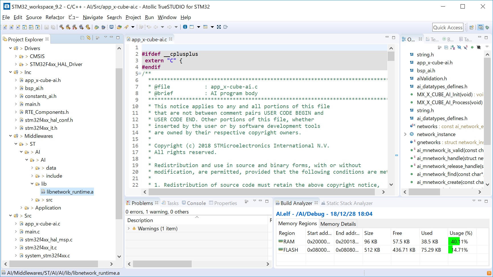
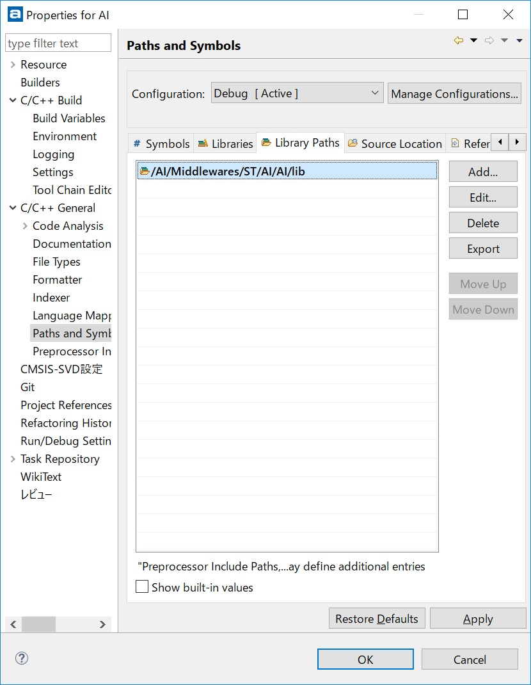
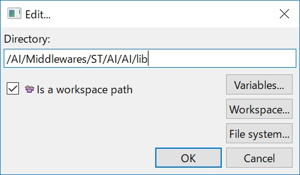
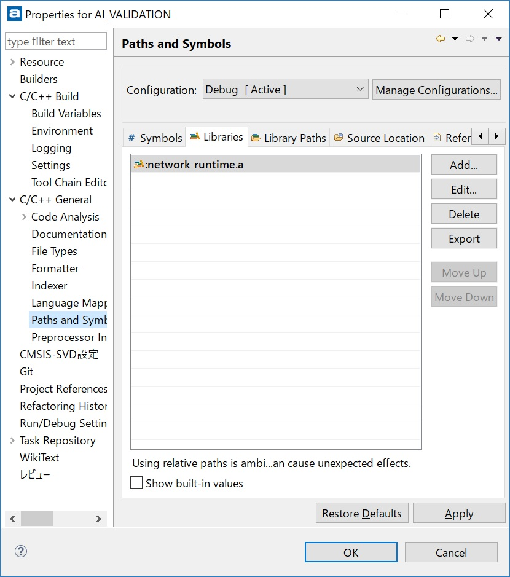

# X-CUBE-AI ver 3.3.0 evaluation

## X-CUBE-AI

https://www.st.com/en/embedded-software/x-cube-ai.html

## X-CUBE-AI guide

I just followed the instructions on [this video (YoueTube)](https://www.youtube.com/watch?v=grgNXdkmzzQ&list=PLnMKNibPkDnG9IC5Nl9vJg1CKMAO1kODW&t=141s&index=2).

## Loading Keras model into CubeMX

I loaded a Keras model in [this folder](../Thermography/tensorflow) into CubeMX.

## Validation result on CubeMX

It takes around 10msec to infer rock-paper-scissors on 32x32 image from the infrared array sensor.

```
ON-DEVICE STM32 execution ("network", auto-detect, 115200)..

<Stm32com id=0x29970dad588 - CONNECTED(COM6/115200) devid=0x433/STM32F401xD/E msg=1.0>
 0x433/STM32F401xD/E @84MHz/84MHz (FPU is present) lat=2 ART: PRFTen ICen DCen
 found network(s): ['network']
 description    : 'network' (32, 32, 1)-[4]->(1, 1, 3) macc=950717 rom=32.26KiB ram=23.13KiB
 tools versions : rt=(3, 3, 0) tool=(3, 3, 0)/(1, 1, 0) api=(1, 0, 0) "Fri Dec 28 17:48:53 2018"

Running with inputs=(10, 32, 32, 1)..
.... 1/10
.... 2/10
.... 3/10
.... 4/10
.... 5/10
.... 6/10
.... 7/10
.... 8/10
.... 9/10
.... 10/10
 RUN Stats    : batches=10 dur=7.078s tfx=6.703s 5.985KiB/s (wb=40.000KiB,rb=120B)

Results for 10 inference(s) @84/84MHz (macc:950717)
 duration    : 99.353 ms (average)
 CPU cycles  : 8345624 (average)
 cycles/MACC : 8.78 (average for all layers)

Inspector report (layer by layer)
 signature      : 761E9573
 n_nodes        : 4
 num_inferences : 10

Clayer  id  desc                          oshape            ms        
--------------------------------------------------------------------------------
0       0   10011/(Merged Conv2d / Pool)  (10, 15, 15, 16)  31.121    
1       2   10011/(Merged Conv2d / Pool)  (10, 6, 6, 32)    67.856    
2       6   10005/(Dense)                 (10, 1, 1, 3)     0.366     
3       6   10014/(Softmax)               (10, 1, 1, 3)     0.010     
                                                            99.353 (total)

  MACC / frame: 950717
  ROM size:     32.26 KBytes
  RAM size:     23.13 KBytes (Minimum: 23.13 KBytes)


Matching criteria: L2 error < 0.01 on the output tensor

  Ref layer 6 matched with C layer 3, error: 1.6289759e-07

Validation: OK
 Validation OK
Python validation ended
```

## Code reading on application template generated by CubeMX

=> **[APPLICATION_TEMPLATE](APPLICATION_TEMPLATE.md)**

## Experiment next

I will try the following setup:

```

[PC]---32x32 image--->[STM32]---inference result--->[PC]

```

## Tips for TrueSTUDIO

It seems to require extra steps for building the auto-generated code on TrueSTUDIO.

[Step 1] Rename the auto generated lib file from "network_runtime.a" to "libnetwork_runtime.a" as a shared C library.



[Step 2] Add the lib path





[Step 3] Add the lib name


