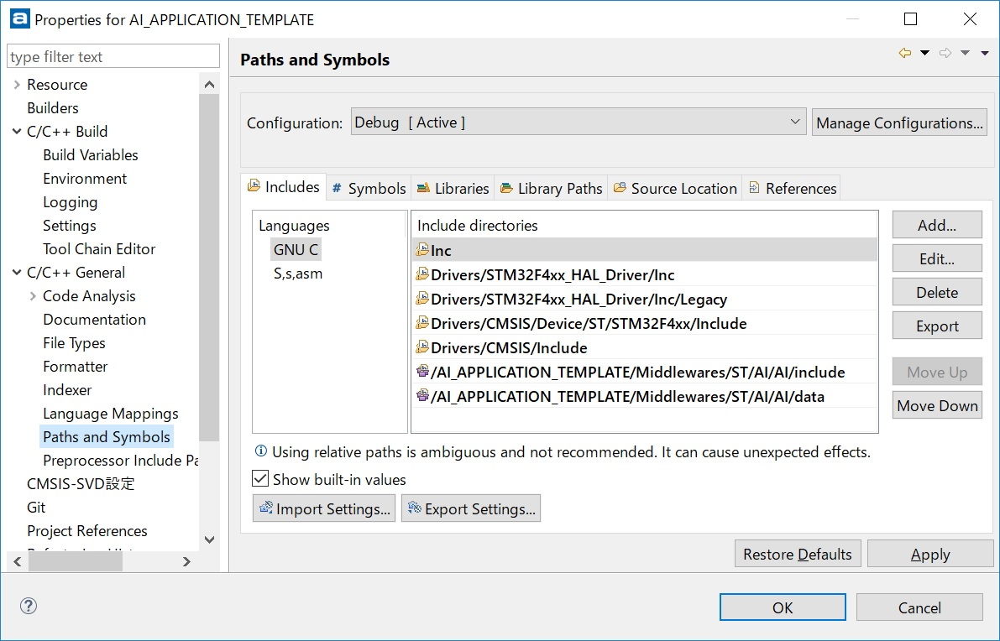

# X-CUBE-AI ver 3.3.0 evaluation

## X-CUBE-AI

- [STM32 solutions for Artificial Neural Networks](https://www.st.com/content/st_com/en/stm32-ann.html)
- [X-CUBE-AI](https://www.st.com/en/embedded-software/x-cube-ai.html)

## X-CUBE-AI guide

I just followed the instructions on [this video (YoueTube)](https://www.youtube.com/watch?v=grgNXdkmzzQ&list=PLnMKNibPkDnG9IC5Nl9vJg1CKMAO1kODW&t=141s&index=2).

## Loading Keras model into CubeMX

I loaded a Keras model in [this folder](../Thermography/tensorflow) into CubeMX. The model "rock-paper-scissors" was trained with normalized dataset of float type with its range -1.0 ~ +1.0.

## Validation result on CubeMX

It takes around 10msec to infer rock-paper-scissors on 32x32 image from the infrared array sensor.

```
Matching results...
Unable to compress to target: 4.000000 wanted, 3.080142 reached

ON-DEVICE STM32 execution ("network", auto-detect, 115200)..

<Stm32com id=0x279c8127080 - CONNECTED(COM6/115200) devid=0x433/STM32F401xD/E msg=1.0>
 0x433/STM32F401xD/E @84MHz/84MHz (FPU is present) lat=2 ART: PRFTen ICen DCen
 found network(s): ['network']
 description    : 'network' (32, 32, 1)-[4]->(1, 1, 3) macc=950717 rom=23.14KiB ram=23.13KiB
 tools versions : rt=(3, 3, 0) tool=(3, 3, 0)/(1, 1, 0) api=(1, 0, 0) "Mon Dec 31 08:42:10 2018"

Running with inputs=(10, 32, 32, 1)..
.... 1/10
.... 2/10
.... 3/10
.... 4/10
.... 5/10
.... 6/10
.... 7/10
.... 8/10
.... 9/10
.... 10/10
 RUN Stats    : batches=10 dur=7.062s tfx=6.575s 6.101KiB/s (wb=40.000KiB,rb=120B)

Results for 10 inference(s) @84/84MHz (macc:950717)
 duration    : 99.405 ms (average)
 CPU cycles  : 8350026 (average)
 cycles/MACC : 8.78 (average for all layers)

Inspector report (layer by layer)
 signature      : 761E9573
 n_nodes        : 4
 num_inferences : 10

Clayer  id  desc                          oshape            ms        
--------------------------------------------------------------------------------
0       0   10011/(Merged Conv2d / Pool)  (10, 15, 15, 16)  31.126    
1       2   10011/(Merged Conv2d / Pool)  (10, 6, 6, 32)    67.844    
2       6   10005/(Dense)                 (10, 1, 1, 3)     0.425     
3       6   10014/(Softmax)               (10, 1, 1, 3)     0.010     
                                                            99.405 (total)

  MACC / frame: 950717
  ROM size:     23.14 KBytes
  RAM size:     23.13 KBytes (Minimum: 23.13 KBytes)
  Comp. factor: 1.394


Matching criteria: L2 error < 0.01 on the output tensor

  Ref layer 6 matched with C layer 3, error: 0.0038189557

Validation: OK
 Validation OK
Python validation ended
```

## Performance test result

```
#
# AI system performance measurement 2.1
#
Compiled with GCC 6.3.1
STM32 Runtime configuration...
 Device       : DevID:0x00000433 (UNKNOWN) RevID:0x00001001
 Core Arch.   : M4 - FPU PRESENT and used
 HAL version  : 0x01070400
 system clock : 84 MHz
 FLASH conf.  : ACR=0x00000702 - Prefetch=True $I/$D=(True,True) latency=2

AI Network (AI platform API 1.0.0)...

Found network "network"
Creating the network "network"..
Network configuration...
 Model name         : network
 Model signature    : 21c022f2cfdcffb0abb14b381ae52db9
 Model datetime     : Wed Jan  2 03:59:12 2019
 Compile datetime   : Jan  2 2019 04:27:27
 Runtime revision   :  (3.3.0)
 Tool revision      : (rev-) (3.3.0)
Network info...
  signature         : 0x0
  nodes             : 4
  complexity        : 950717 MACC
  activation        : 23684 bytes
  weights           : 33036 bytes
  inputs/outputs    : 1/1
  IN tensor format  : HWC layout:32,32,1 (s:1024 f:AI_BUFFER_FORMAT_FLOAT)
  OUT tensor format : HWC layout:1,1,3 (s:3 f:AI_BUFFER_FORMAT_FLOAT)
Initializing the network

Running PerfTest on "network" with random inputs (16 iterations)...
................

Results for "network", 16 inferences @84MHz/84MHz (complexity: 950717 MACC)
 duration     : 99.383 ms (average)
 CPU cycles   : 8348200 -156/+273 (average,-/+)
 CPU Workload : 9%
 cycles/MACC  : 8 (average for all layers)
 used stack   : 352 bytes
 used heap    : 0:0 0:0 (req:allocated,req:released) cfg=0

Press any key to continue..
```

## Inference test on my original Keras model "rock-paper-scissors

Input data for testing the neural network is in this folder: http://localhost:8888/tree/Documents/GitHub/stm32-mcu/NUCLEO-F401RE/Thermography/thermography/data

I picked up one input data "rock":
```
static ai_float in_data[AI_MNETWORK_IN_1_SIZE] = { 17.8, 17.8, 17.8, 17.8, 17.7,
		17.8, 17.8, 17.8, 17.8, 17.7, 17.7, 17.7, 17.6, 17.5, 17.4, 17.3, 17.2,
		17.2, 17.3, 17.5, 17.7, 18.0, 18.2, 18.3, 18.3, 18.2, 18.1, 18.0, 17.8,
		17.7, 17.5, 17.2, 17.9, 17.9, 18.0, 18.0, 18.0, 18.0, 18.0, 18.0, 18.0,
		18.0, 17.9, 17.8, 17.8, 17.7, 17.7, 17.6, 17.5, 17.5, 17.4, 17.5, 17.7,
		17.9, 18.1, 18.1, 18.1, 18.0, 18.1, 18.1, 18.0, 17.8, 17.6, 17.4, 17.9,
		18.0, 18.1, 18.2, 18.2, 18.2, 18.3, 18.3, 18.3, 18.3, 18.2, 18.0, 18.0,
		18.0, 18.0, 17.9, 17.9, 17.7, 17.7, 17.8, 17.8, 17.9, 18.1, 18.0, 18.0,
		18.1, 18.3, 18.2, 18.1, 18.0, 17.8, 17.6, 18.0, 18.1, 18.2, 18.3, 18.4,
		18.4, 18.4, 18.5, 18.6, 18.6, 18.6, 18.5, 18.4, 18.4, 18.5, 18.5, 18.4,
		18.2, 18.1, 18.2, 18.3, 18.2, 18.2, 18.1, 18.2, 18.3, 18.5, 18.4, 18.3,
		18.1, 17.9, 17.8, 18.0, 18.1, 18.2, 18.4, 18.5, 18.5, 18.6, 18.7, 18.8,
		18.9, 18.9, 19.0, 19.0, 19.1, 19.2, 19.2, 19.2, 19.1, 19.0, 18.9, 18.9,
		18.8, 18.7, 18.6, 18.6, 18.7, 18.7, 18.6, 18.5, 18.3, 18.1, 17.9, 18.0,
		18.1, 18.2, 18.4, 18.5, 18.5, 18.6, 18.8, 19.0, 19.1, 19.3, 19.5, 19.7,
		20.0, 20.3, 20.4, 20.4, 20.4, 20.3, 20.2, 20.1, 19.9, 19.6, 19.3, 19.1,
		19.0, 18.9, 18.7, 18.5, 18.3, 18.1, 18.1, 17.9, 18.1, 18.2, 18.4, 18.4,
		18.5, 18.6, 18.8, 19.0, 19.4, 19.7, 20.0, 20.5, 21.3, 21.7, 22.1, 22.2,
		22.2, 22.1, 22.0, 21.9, 21.4, 20.9, 20.2, 19.6, 19.3, 19.1, 18.8, 18.5,
		18.3, 18.2, 18.4, 17.9, 18.0, 18.2, 18.3, 18.4, 18.5, 18.7, 18.9, 19.2,
		19.7, 20.2, 20.8, 21.8, 22.8, 23.4, 23.8, 24.1, 24.2, 24.1, 24.1, 23.6,
		23.0, 22.4, 21.6, 20.5, 19.8, 19.4, 18.9, 18.5, 18.4, 18.5, 18.6, 17.9,
		18.1, 18.2, 18.3, 18.5, 18.7, 18.9, 19.2, 19.7, 20.3, 21.1, 22.1, 23.3,
		24.3, 25.0, 25.6, 25.9, 26.1, 26.1, 25.9, 25.4, 24.7, 23.9, 23.0, 21.8,
		20.7, 19.8, 19.2, 18.8, 18.7, 18.7, 18.9, 18.0, 18.2, 18.3, 18.5, 18.7,
		19.0, 19.4, 19.9, 20.5, 21.3, 22.3, 23.4, 24.6, 25.7, 26.5, 27.1, 27.5,
		27.7, 27.7, 27.4, 26.9, 26.2, 25.3, 24.3, 23.0, 21.7, 20.6, 19.8, 19.3,
		19.1, 19.0, 19.0, 18.2, 18.4, 18.6, 18.8, 19.1, 19.6, 20.1, 20.8, 21.6,
		22.7, 23.4, 24.6, 25.8, 26.8, 27.6, 28.1, 28.5, 28.7, 28.6, 28.3, 27.8,
		27.1, 26.5, 25.5, 24.1, 22.7, 21.5, 20.6, 19.8, 19.4, 19.2, 19.0, 18.5,
		18.7, 19.0, 19.3, 19.7, 20.3, 21.1, 21.9, 23.4, 24.5, 25.1, 25.7, 26.8,
		27.8, 28.4, 28.9, 29.2, 29.3, 29.1, 28.8, 28.4, 28.0, 27.6, 26.6, 25.2,
		23.9, 22.6, 21.5, 20.4, 19.7, 19.3, 19.0, 18.8, 19.2, 19.5, 20.0, 20.6,
		21.3, 22.2, 23.7, 25.2, 26.3, 26.9, 27.2, 27.7, 28.5, 29.0, 29.3, 29.4,
		29.4, 29.3, 29.1, 29.0, 28.9, 28.5, 27.5, 26.3, 25.0, 23.6, 22.3, 21.2,
		20.2, 19.5, 19.0, 19.2, 19.6, 20.2, 20.8, 21.5, 22.5, 23.9, 25.4, 26.7,
		27.8, 28.4, 28.7, 28.8, 29.0, 29.3, 29.4, 29.4, 29.4, 29.5, 29.6, 29.6,
		29.6, 29.2, 28.3, 27.2, 25.8, 24.4, 23.0, 21.8, 20.8, 19.8, 19.0, 19.5,
		20.2, 20.9, 21.7, 22.7, 23.6, 24.9, 26.3, 27.7, 28.7, 29.1, 29.2, 29.2,
		29.4, 29.6, 29.7, 29.7, 29.6, 29.7, 29.9, 30.1, 30.1, 29.6, 28.7, 27.5,
		26.2, 24.8, 23.5, 22.2, 21.1, 20.0, 19.1, 19.9, 20.8, 21.7, 22.8, 24.2,
		25.1, 25.7, 26.8, 28.1, 29.0, 29.2, 29.2, 29.3, 29.5, 29.7, 29.9, 29.9,
		29.8, 29.9, 30.2, 30.4, 30.3, 29.8, 28.8, 27.6, 26.4, 25.1, 23.8, 22.6,
		21.3, 20.2, 19.2, 20.3, 21.4, 22.7, 24.3, 25.8, 26.6, 27.0, 27.3, 28.3,
		29.0, 29.1, 29.2, 29.3, 29.5, 29.7, 29.9, 30.0, 30.0, 30.1, 30.4, 30.5,
		30.3, 29.8, 28.8, 27.7, 26.6, 25.3, 24.0, 22.7, 21.5, 20.3, 19.3, 20.8,
		22.3, 24.1, 25.8, 27.1, 28.0, 28.4, 28.5, 28.5, 29.0, 29.1, 29.2, 29.3,
		29.5, 29.6, 29.8, 30.0, 30.1, 30.3, 30.4, 30.4, 30.2, 29.7, 28.8, 27.7,
		26.5, 25.2, 23.9, 22.7, 21.6, 20.5, 19.4, 21.4, 23.2, 25.0, 26.7, 28.0,
		28.8, 29.1, 29.1, 29.0, 29.1, 29.2, 29.3, 29.4, 29.5, 29.6, 29.8, 30.0,
		30.1, 30.3, 30.4, 30.4, 30.2, 29.6, 28.7, 27.5, 26.2, 24.9, 23.6, 22.5,
		21.5, 20.5, 19.5, 22.1, 23.7, 25.3, 27.0, 28.4, 29.2, 29.3, 29.2, 29.2,
		29.2, 29.4, 29.5, 29.5, 29.6, 29.8, 29.9, 30.1, 30.2, 30.3, 30.5, 30.4,
		30.2, 29.6, 28.6, 27.3, 26.0, 24.5, 23.1, 22.2, 21.3, 20.4, 19.6, 22.8,
		24.3, 25.7, 27.1, 28.5, 29.2, 29.2, 29.4, 29.4, 29.4, 29.5, 29.7, 29.8,
		29.8, 29.9, 30.1, 30.2, 30.1, 30.2, 30.4, 30.5, 30.1, 29.5, 28.4, 27.2,
		25.6, 23.8, 22.5, 21.7, 21.1, 20.4, 19.7, 23.2, 24.8, 26.2, 27.4, 28.5,
		29.2, 29.5, 29.6, 29.6, 29.6, 29.6, 29.8, 30.0, 30.0, 30.1, 30.2, 30.2,
		30.1, 30.1, 30.2, 30.3, 30.0, 29.3, 28.2, 26.7, 24.8, 23.0, 21.7, 21.0,
		20.6, 20.2, 19.8, 23.5, 25.0, 26.4, 27.7, 28.6, 29.3, 29.7, 29.8, 29.8,
		29.7, 29.8, 29.9, 30.1, 30.2, 30.3, 30.2, 30.1, 30.0, 30.0, 30.0, 30.0,
		29.7, 29.0, 27.7, 25.9, 24.1, 22.4, 21.1, 20.4, 20.0, 19.9, 19.8, 23.4,
		25.1, 26.5, 27.8, 28.8, 29.5, 29.8, 29.9, 29.9, 29.9, 29.9, 30.1, 30.2,
		30.3, 30.3, 30.2, 30.1, 30.0, 30.0, 29.9, 29.8, 29.3, 28.4, 27.2, 25.5,
		23.6, 21.9, 20.7, 20.1, 19.9, 19.8, 19.7, 23.1, 25.0, 26.6, 27.9, 29.0,
		29.7, 30.0, 30.2, 30.1, 30.0, 30.0, 30.1, 30.2, 30.3, 30.3, 30.2, 30.1,
		30.1, 29.9, 29.8, 29.5, 28.7, 27.6, 26.3, 25.0, 23.4, 21.6, 20.6, 20.1,
		20.0, 19.7, 19.7, 22.7, 24.6, 26.5, 27.9, 29.0, 29.8, 30.2, 30.3, 30.1,
		30.0, 30.1, 30.1, 30.2, 30.3, 30.3, 30.2, 30.2, 30.1, 29.8, 29.5, 28.8,
		27.8, 26.6, 25.4, 24.1, 22.9, 21.4, 20.5, 20.1, 19.8, 19.7, 19.7, 22.2,
		24.2, 26.1, 27.7, 29.0, 29.7, 30.1, 30.2, 30.1, 30.0, 30.0, 30.1, 30.2,
		30.3, 30.3, 30.3, 30.3, 30.0, 29.6, 28.9, 27.9, 26.8, 25.7, 24.5, 23.2,
		22.1, 21.2, 20.4, 20.0, 19.8, 19.7, 19.7, 21.9, 23.9, 25.8, 27.5, 28.7,
		29.6, 30.0, 30.1, 30.0, 30.0, 30.0, 30.1, 30.1, 30.2, 30.3, 30.2, 30.1,
		29.7, 29.1, 28.2, 27.2, 26.0, 24.8, 23.7, 22.6, 21.6, 20.7, 20.2, 19.8,
		19.7, 19.7, 19.8, 21.7, 23.7, 25.6, 27.2, 28.3, 29.2, 29.8, 30.0, 29.9,
		29.9, 30.0, 30.0, 30.1, 30.1, 30.1, 30.1, 29.9, 29.4, 28.7, 27.6, 26.6,
		25.3, 24.0, 22.9, 21.9, 21.1, 20.5, 20.1, 19.7, 19.6, 19.7, 19.8, 21.5,
		23.5, 25.2, 26.6, 27.8, 28.7, 29.4, 29.7, 29.8, 29.8, 29.9, 30.0, 30.0,
		30.0, 30.0, 29.9, 29.6, 29.2, 28.4, 27.1, 25.9, 24.6, 23.3, 22.3, 21.3,
		20.6, 20.3, 20.0, 19.8, 19.7, 19.7, 19.8, 21.4, 23.2, 24.7, 26.0, 27.2,
		28.1, 28.8, 29.3, 29.6, 29.7, 29.8, 29.9, 29.9, 29.9, 29.9, 29.7, 29.6,
		29.1, 28.2, 26.7, 25.2, 23.9, 22.7, 21.6, 20.8, 20.4, 20.1, 20.0, 19.9,
		19.8, 19.8, 19.9, 21.2, 22.8, 24.2, 25.5, 26.6, 27.5, 28.3, 28.9, 29.3,
		29.5, 29.6, 29.7, 29.7, 29.7, 29.7, 29.7, 29.4, 28.9, 27.9, 26.5, 24.9,
		23.3, 21.9, 21.0, 20.4, 20.1, 20.0, 20.0, 20.0, 20.0, 20.0, 20.0 };
static ai_float out_data[AI_MNETWORK_OUT_1_SIZE];

```

Then I made some scaling on the input data to fit it into -1.0 to 1.0 range:
```
	float sum = 0.0f;
	float mean = 0.0f;
	float max_ = 0.0f;
	float min_ = 80.0f;
	float range_;
	for (int i = 0; i < AI_MNETWORK_IN_1_SIZE; i++) {
		sum += in_data[i];
		if (in_data[i] > max_)
			max_ = in_data[i];
		if (in_data[i] < min_)
			min_ = in_data[i];
	}
	mean = (max_ + min_) / 2.0;
	range_ = (max_ - min_) / 2.0;
	for (int i = 0; i < AI_MNETWORK_IN_1_SIZE; i++) {
		in_data[i] = (in_data[i] - mean) / range_;
	}
```

The order of classes is [paper, rock, scissors].

I ran inference on STM32, and the result (x 100) seemed OK:
```
Inference:[19, 80, 0]
```

## How to run the network

=> **[CODE_READING](CODE_READING.md)**

## Experiment next

I will try the following setup:

```

[PC]---32x32 image--->[STM32]---inference result--->[PC]

```

## Tips for TrueSTUDIO

I guess "Add necessary files as reference in the toolchain project config files" is the right option to select on Code Generator, but it did not work on TrueSTUDIO.

So I left the option to default, and I managed to build the code with extra steps as below:

[Step 1] Add the lib path


[Step 2] Add the lib name


[Step 3] Add include paths (for Application Template only)


