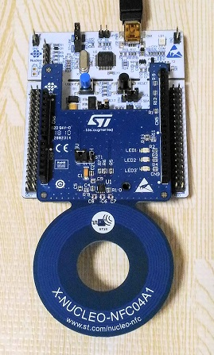

# Dynamic NFC tag (STMicro's ST25DV04K)

## Operations

[1] A smart phone initiates a service.

```
   Sleeping                                         
    [STM32]          [ST25]<---RF----[Smart phone] User
      ^               GPO                           
      |                |
      +----------------+
           Interrupt
```

[1b(optional)] The device notifies a BLE central of the RF field change event 

```
       +--------NOTIFY---------------------------->[BLE central]
       |
   [RN4020]                                         
    [STM32]          [ST25]<---RF----[Smart phone] User
```

[2] The device wakes up and prepares a service for the user in a very short time.

```
[Local service function]<---[Sensor] ((( gesture, shape, color ...
       |
       v
    [STM32]          [ST25]<---RF----[Smart phone] User
Service preparation  
```

[3] The device provides a service URL to the smartphone.

```
    [STM32]---I2C--->[ST25]----RF--->[Smart phone]----GET---->[Web application server]
                             (URL)
```

[4] The smartphone fetchs the page from a web server.

```
    [STM32]          [ST25]          [Smart phone]<---200 OK--[Web application server]
```

## Dynamic NFC tag device



- [Host MCU: NUCLEO F401RE](https://www.st.com/en/evaluation-tools/nucleo-f401re.html)
- [NFC tag: X-NUCLEO-NFC04A1(ST25DV04K)](https://www.st.com/en/ecosystems/x-nucleo-nfc04a1.html)
- [NFC tag: ANT7-T-ST25DV04K](https://www.st.com/en/evaluation-tools/ant7-t-st25dv04k.html)

## Code

### MCU with ST25

==> **[code](./stm32/Dynamic_NFC)**

- The code supports power management for the MCU.
- The code puts the MCU into sleep after start up, so TrueSTUDIO on my PC cannot communicate with the MCU. In this case, hold a smart phone over the antenna to keep the MCU awaken.
- To disable the power management (to use GPO on PA9 as an interrupt to signal RF change to MCU), just comment out the following line:

main.c
```
#define SLEEP_ENABLED
```

**UART commands**

|Command   |Description                        |
|----------|-----------------------------------|
|.l        |Lock RF write (default)            |
|.u        |Unlock RF write                    |
|any string|Write base URL to Area 2 on EEPROM |

Note: The current implementation of local service function just copies the base URL with a serial number appended to Area 1 on EEPROM.

### HTTPS server for testing the device

==> **[code](./webapp)**

## A bug in X-CUBE-NFC4/CubeMX

BSP folder is removed whenever code is generated by CubeMX after the initial generation. Copy BSP into the folder manually to cope with the problem.

## Dynamic NFC tag from other makers

The biggest problem using ST25 in this project is EEPROM wearing. 

NTAG I2C plus seems more appropriate for this project, since it supports "pass-through" mode:
- [NXP NTAG I2C plus NT3H2111_2211](https://www.nxp.com/docs/en/data-sheet/NT3H2111_2211.pdf)
- [NXP NTAG I2C plus Exploler kit](https://www.nxp.com/products/identification-security/rfid/nfc-hf/ntag/nfc-tags-for-electronics/ntag-ic-iplus-i-explorer-kit:OM5569-NT322E)

Anyway, I use ST25 for the time being.

## References

- [ST25DV04K(Dynamic NFC tag)](https://www.st.com/en/nfc/st25dv04k.html)
- ["NFC Tap" Android app for ST25](https://www.st.com/content/st_com/en/products/embedded-software/st25-nfc-rfid-software/stsw-st25001.html)
- [ST25 SDK(jar)](https://my.st.com/content/my_st_com/en/products/embedded-software/st25-nfc-rfid-software/stsw-st25sdk001.html)
- [ST25 Webapp(html5)](https://smarter.st.com/st25-nfc-web-application/?icmp=tt7281_gl_lnkon_may2018)
