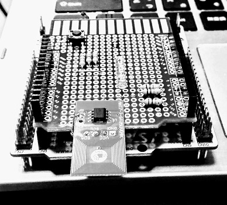

# ST25DV04K

This chip ["ST25DV04K"](https://www.st.com/en/nfc/st25dv-i2c-series-dynamic-nfc-tags.html) from STMicro can be used for showing an internal status of a home appliance to the user's smart phone.

## Typical operations (my guess)

[1] A smart phone initiates a service.

```
   Sleeping                                         
    [STM32]          [ST25DV]<---RF----[Smart phone] User
      ^               GPO                           
      |                |
      +----------------+
           Interrupt
```

[1b(optional)] The device notifies a BLE central of the RF field change event 

```
       +--------NOTIFY---------------------------->[BLE central]
       |
   [RN4020]                                         
    [STM32]          [ST25DV]<---RF----[Smart phone] User
```

[2] The device prepares a service for the user in a very short time.

```
[Local service function]<---[Sensor] ((( gesture, shape, color ...
       |
       v
    [STM32]          [ST25DV]<---RF----[Smart phone] User
Service preparation  
```

[3] The device provides a service URL to the smartphone.

```
    [STM32]---I2C--->[ST25]----RF--->[Smart phone]----GET---->[Web application server]
                             (URL)
```

[4] The smartphone fetchs the page from a web server.

```
    [STM32]          [ST25]          [Smart phone]<---200 OK--[Web application server]
```

Note: the last data written on the tag (e.g., on EEPROM) will remain even if the battery dies.

## Internal status of home appliance

- Initial setup: URL of its startup manual page
- Serial number (fixed number): URL of a user registration page
- Error code: URL of its trouble shooting page
- etc

In this project, I only support a serial number that is incremented every time the user hold his or her smart phone over the NFC tag.

## Parts

- [Host MCU: NUCLEO F401RE](https://www.st.com/en/evaluation-tools/nucleo-f401re.html)
- [NFC tag: X-NUCLEO-NFC04A1(ST25DV04K)](https://www.st.com/en/ecosystems/x-nucleo-nfc04a1.html)
- [NFC tag: ANT7-T-ST25DV04K](https://www.st.com/en/evaluation-tools/ant7-t-st25dv04k.html)

## Code

### MCU with ST25DV

IDE: CubeIDE from STMicro.

==> **[Code](./stm32/Dynamic_NFC)**

- The code supports power management for the MCU.
- The code puts the MCU into sleep after start up, so CubeIDE cannot communicate with the MCU. In this case, hold a smart phone over the antenna to keep the MCU awaken.
- To disable the power management (to use GPO on PA9 as an interrupt to signal RF change to MCU), just comment out the following line:

main.c
```
#define SLEEP_ENABLED
```

**UART commands**

|Command                          |Description                        |
|---------------------------------|-----------------------------------|
|.l                               |Lock RF write (default)            |
|.u                               |Unlock RF write                    |
|<base url w/o protocol>?loc=<loc>|Write base URL to Area 2 on EEPROM |

Note: The current implementation of local service function just copies the base URL with a serial number, as an internal status of a home appliance, appended to Area 1 on EEPROM.

### HTTPS server for testing the device

==> **[Code](./webapp)**

### Home appliances

==> **[Code](./home_appliances)**

### Arduino shield of ANT7-T-ST25DV04K



I refered to the schematic of X-NUCLEO-NFC04A1(ST25DV04K) to design Arduino shield for ANT7-T-ST25DV04K with some modifications as follows:
- I omitted some small stuff such as bypass capacitors, because the board size is small.
- I chose 10k ohm pull-up registors for I2C. I think 10k ohm is relatively large, but it should work at 400kHz of SCL clock cycle in my experience.
- I chose a 51k ohm pull-up registor for open-drain GPO.

==> **[Circuit](./kicad/ant7_t_st25dv04k.pdf)**

==> **[Universal board](./kicad/arduino_shield_ant7_t_st25dv04k.pdf)**

## A bug in X-CUBE-NFC4/CubeMX

BSP folder is removed whenever code is generated by CubeMX after the initial generation. Copy BSP into the folder manually to cope with the problem.

## Future direction

["ADUX1020"](https://www.analog.com/en/products/adux1020.html) from Analog Devices is very interesting as a very small contactless gester sensing device in combination with dynamic NFC tag (not limited to STMicro's products but also from other makers such as NXP or SONY).
