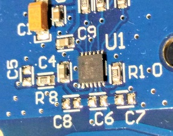

# Dynamic NFC tag (STMicro's ST25DV04K)



ST25DV04K (4K = 512bytes EEPROM)

## Dynamic NFC tag "ST25"

ST25 supports bi-directional communication in a passive way, so it can be thought of as a reader/writer powerd by a smartphone via RF.

## Why I am so interested in dynaminc NFC tag

Dynamic NFC tag is exactly what I have been looking for since three years ago, to make things talk to smart phones. Think different -- IoT in a different way.

## Service enabled by ST25

[1] A smart phone initiates a service.

```
   Sleeping                                         
    [STM32]          [ST25]<---RF----[Smart phone] User
      ^               GPO                           
      |                |
      +----------------+
           Interrupt
```

[2] The system wakes up and prepares a service for the user in a very short time.

```
[(optional)X-CUBE-AI   ]
[Local service function]<---[Sensor] ((( gesture, shape, color ...
       |
       v
    [STM32]          [ST25]<---RF----[Smart phone] User
Service preparation  
```

[3] The system provides a service URL to the smartphone.

```
    [STM32]---I2C--->[ST25]----RF--->[Smart phone]----GET---->[Web application server]
                             (URL)
```

[4] The smartphone fetchs the page from a web server.

```
    [STM32]          [ST25]          [Smart phone]<---200 OK--[Web application server]
```

## Platform

### Smart phones

- Android
- iPhone "Core NFC": https://www.idownloadblog.com/2018/09/14/apple-core-nfc-background-tag-reading/

### Dynamic NFC tag device


- [Host MCU: NUCLEO F401RE](https://www.st.com/en/evaluation-tools/nucleo-f401re.html)
- [NFC tag: X-NUCLEO-NFC04A1(ST25DV04K)](https://www.st.com/en/ecosystems/x-nucleo-nfc04a1.html)

I am also purchasing the following tag that is much smaller than X-NUCLEO-NFC04A1:
- [NFC tag: ANT7-T-ST25DV04K](https://www.st.com/en/evaluation-tools/ant7-t-st25dv04k.html)

### Web applications

- Server: Node.js with express.js and EJS template engine
- Client: Vue.js as SPA framework

## Code

### MCU with ST25

==> **[code](./stm32/Dynamic_NFC)**

- The code supports power management for the MCU.
- The code puts the MCU into sleep after start up, so TrueSTUDIO on my PC cannot communicate with the MCU. In this case, hold a smart phone over the antenna to keep the MCU awaken.
- To disable the power management (to use GPO on PA9 as an interrupt to signal RF change to MCU), just comment out the following line:

main.c
```
#define SLEEP_ENABLED
```

**UART commands**

|Command   |Description                        |
|----------|-----------------------------------|
|.l        |Lock RF write (default)            |
|.u        |Unlock RF write                    |
|any string|Write base URL to Area 2 on EEPROM |

Note: The current implementation of local service function just copies the base URL with a serial number appended to Area 1 on EEPROM.

### HTTPS web application server

This is just a skeltpne of web application server.

==> **[code](./node)**

## A bug in X-CUBE-NFC4/CubeMX

BSP folder is removed whenever code is generated by CubeMX after the initial generation. Copy BSP into the folder manually to cope with the problem.

## References

- [ST25DV04K(Dynamic NFC tag)](https://www.st.com/en/nfc/st25dv04k.html)
- ["NFC Tap" Android app for ST25](https://www.st.com/content/st_com/en/products/embedded-software/st25-nfc-rfid-software/stsw-st25001.html)
- [ST25 SDK(jar)](https://my.st.com/content/my_st_com/en/products/embedded-software/st25-nfc-rfid-software/stsw-st25sdk001.html)
- [ST25 Webapp(html5)](https://smarter.st.com/st25-nfc-web-application/?icmp=tt7281_gl_lnkon_may2018)
