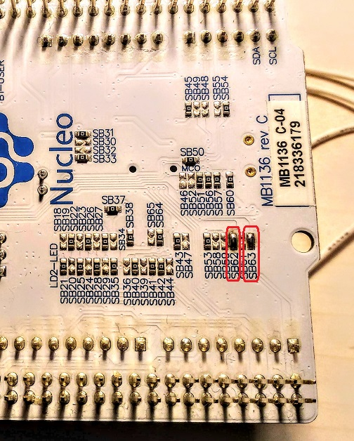
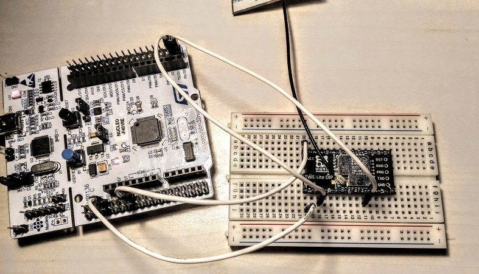

# TWELITE

(Work in progress)

TWELITE is a IEEE802.15.4-based sensor networking technology by [MONO WIRELESS](https://mono-wireless.com/en/).

I have used TWELITE in some IoT projects with PIC16F1 MCU.

## Goal

Run this code on STM32: https://github.com/araobp/pic16f1-mcu/blob/master/src/pic16f18326/amg8833.X/twelite.c

## Set up

### NUCLEO board

SB62 and SB63 need to be shorted to transmit data to D1 or receive data from D0.

### Circuit

