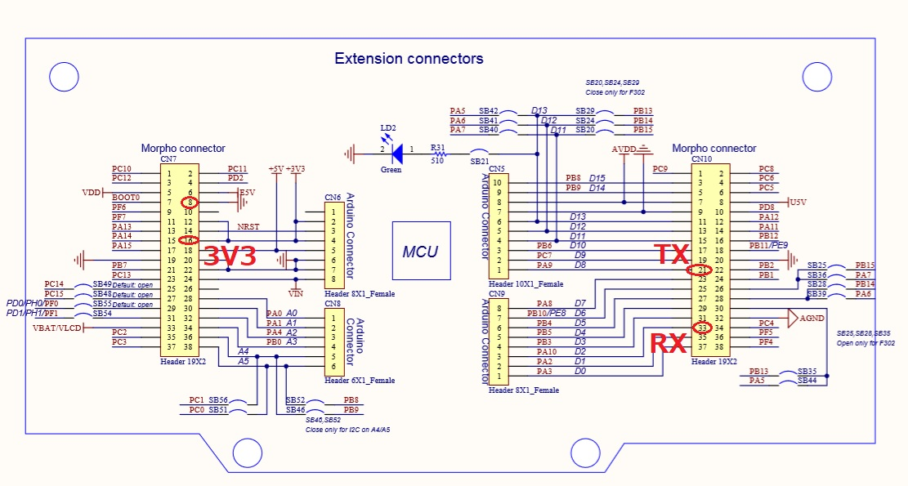

# TWELITE

(Work in progress)

TWELITE is a IEEE802.15.4-based sensor networking technology by a Japanese company [MONO WIRELESS](https://mono-wireless.com/en/).

I used TWELITE with PIC16F1 MCU in a very important IoT projects in Feb 2019. It was very successful, so I will use TWELITE rather than other low-power wireless technologies for the time being.

## Goal

- port this code to STM32: https://github.com/araobp/pic16f1-mcu/blob/master/src/pic16f18326/amg8833.X/twelite.c
- develop drivers and utilities.
- confirm that those programs work.
- use the driver in my edge AI projects.

## Set up

### NUCLEO board

I use USART1 as an UART peripheral for TWELITE.

### Circuit

TWELITE-DIP is powered by 3V3 pin on the NUCLEO board:
```
 NUCLEO      TWELITE
  3V3 ------- VCC
  GND ------- GND
  TX/D1 ----- RX
  RX/D0 ----- TX

```

NUCLEO board:



**==> [TWELITE-DIP](https://mono-wireless.com/jp/products/TWE-APPS/App_Twelite/asset/twe_app_pins.png)**

## Code

I use TWELITE's Binary Transfer Mode to transfer data in a bulk to an edge AI application.

- [Slave node: TWELITE driver and test program for STM32](./stm32)
- [Master node: TWELITE driver and test program for Python](./python)
