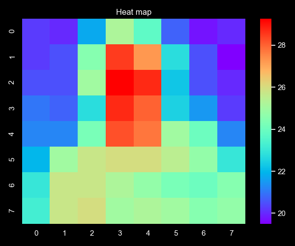
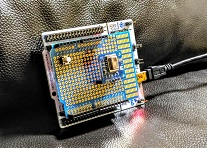
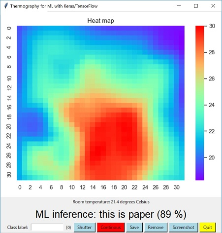
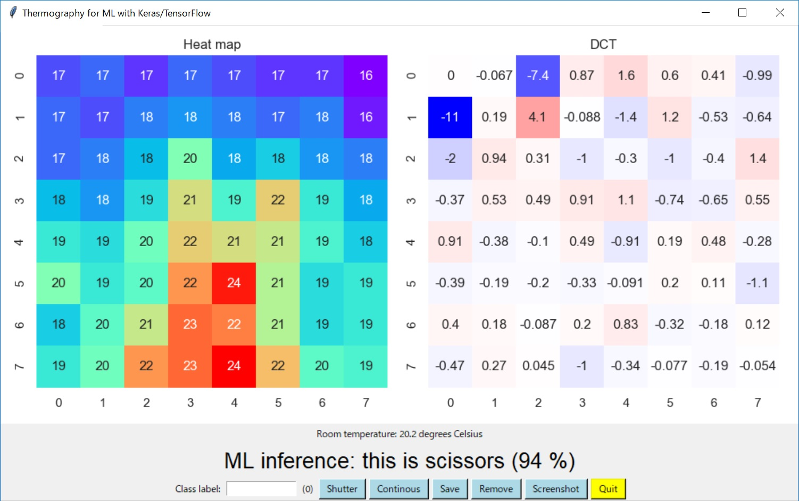
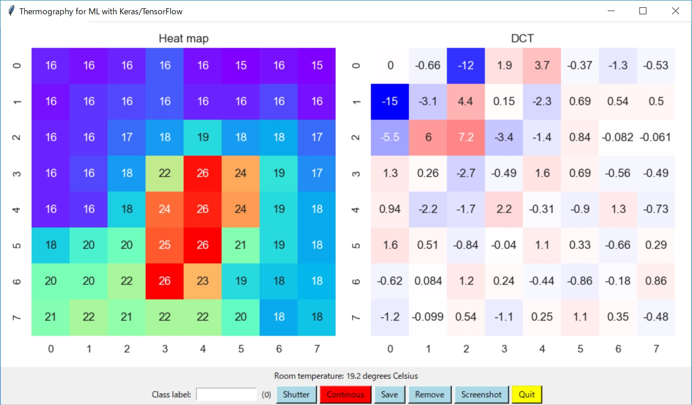
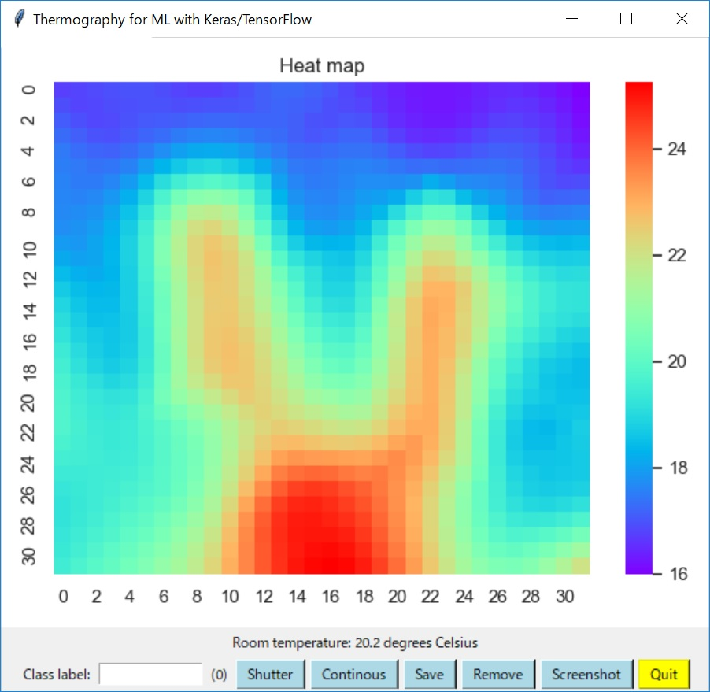

# Thermography



The picture above is me on thermography GUI that I have developed based on matplotlib with Tk.

## Architecture

```  
                 +--------------------------+
                 |      +----------------+  |
                 |      |                |  |
               [R10k] [R10k]             |  |
                 |      |                |  |
                 |      |                |  |
                SCL    SDA               3.3V
           [Infrared sensor]---I2C--->[NUCLEO F401RE]--UART-->[thermography.py/PC]
                GND   3.3V             3.3 GND         
                 |      |                |  |          
                 +      +----------------+  |         
                 +--------------------------+

```

## Infrared array sensor (I2C slave)

- [Infrared array sensor (Panasonic AMG88XX)](https://industrial.panasonic.com/cdbs/www-data/pdf/ADI8000/ADI8000C53.pdf)
- [Data sheet](https://cdn-learn.adafruit.com/assets/assets/000/043/261/original/Grid-EYE_SPECIFICATIONS%28Reference%29.pdf?1498680225)

### Note on AMG88XX

The output data format of AMG88XX is not like a standard image format. On GUI, I made flip twice (verticaly and horizontaly) on the data to convert it into an image format (it is a finder view image, not a mirror image).

## Schematic of my original Arduino shield



- [Arduino shield](./kicad/arduino_board.pdf)

## Implementation

- [I2C adaptor on NUCLEO F401RE with X-CUBE-AI](../AI)
- [Thermography GUI](./thermography)

## Deep learning on rock-paper-scissors with Keras/TensorFlow

### Training CNN model

Class labels:
- rock
- paper
- scissors

(rock.jpg)

(paper.jpg)

(scissors.jpg)

Training data: 2D array of 8 x 8 pixels or 32 x 32 pixels (8 x 8 images interpolated)

Data set: [csv files](./thermography/data)

Training result: [8 x 8 2D images](./tensorflow/CNN_for_rock_paper_scissors.ipynb)

### Using the trained CNN model






## DCT

Descrete Cosine Transform of 2D image shows some features. I am going to use DCT output as an additional feature for training a neural network.



## Interpolation

It is interesting to apply linear interpolation to 8x8 2D images to obtain 32x32 2D image. The image becomes like this:


