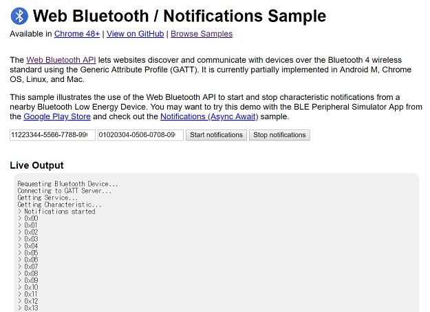

# Microchip RN4020

## Background

I discovered that Microchip [RN4020](https://www.microchip.com/wwwproducts/en/RN4020) module is very easy-to-use. Microchip is a good company.

## Project goal

- A simple python script as a simulator of BLE peripheral
- Android app with a simple GUI to show notification

First of all, I will try [Web Bluetooth](https://developers.google.com/web/updates/2015/07/interact-with-ble-devices-on-the-web) as Android app.

## Set up to transfer data from PC to a smart phone

```
   [Python program]---UART---[RN4020]---BLE---[Web Bluetooth app]
         PC                                     PC or Android
```

## Creating an original service "Edge AI inference"

### On a terminal software

Config
```
+
SF,1
SS,00000001
SR,20000000
PZ
PS,11223344556677889900AABBCCDDEEFF
PC,010203040506070809000A0B0C0D0E0F,10,01
R,1
```

Notify an inference result to a smart phone by [this script](./python/edge_ai_simulator.py)
```
SUW,010203040506070809000A0B0C0D0E0F,03
```

### On BLE scanner (Android app)

I use Android app [BLE Scanner](https://play.google.com/store/apps/details?id=com.macdom.ble.blescanner&hl=en) in this test.

"Hex: 0x08" means the class label is 8.


### On Web Bluetooth (HTML5)

I run the python script on my PC, and I also run ["Web Bluetooth / Notification" sample](https://googlechrome.github.io/samples/web-bluetooth/notifications.htm) on Chrome browser on my PC. It works!

```
Service UUID: 11223344-5566-7788-9900-aabbccddeeff
Characteristic UUID: 01020304-0506-0708-0900-0a0b0c0d0e0f
```



I think Web Bluetooth is good for quick prototyping or making MVP.

A simpler version of "Web Bluetooth / Notification" sample is [here](./html5/notifications.html). Thanks to Vue.js, the html5 code is very simple.

### Raspberry Pi 3 as BLE-WiFi router

They say Bluetooth 5 seems to be the way to go for edge AI.

I saw several BLE-WiFi router products at a trade show held in Tokyo in April 2019. I am quite interested in them, so I develop a prototype of such a router.

I use Microchip RN4020 that supports Bluetooth 4.x.  

I run [the edge AI simulator script](./python/edge_ai_simulator.py) on my PC, and I also run [this script on RasPi](./python/agent.py). It works!

#### Set up: edge AI simulator

```
[main.html]<-- mqtt/WebSocket --[mosquitto]<-- mqtt --[agent.py]<--[BLE module]<-- notify --[RN4020]<--[edge_ai simulator.py]
Chrome browser                     RasPi                RasPi         RasPi                                     RasPi
```

#### Set up: RN4020 sheild on NUCLEO-F401RE

```
[main.html]<-- mqtt/WebSocket --[mosquitto]<-- mqtt --[agent.py]<--[BLE module]<-- notify --[RN4020]<--[edge AI simulator]
Chrome browser                     RasPi                RasPi         RasPi                  Shield      NUCLEO-F401RE    
```

## References

- [RN4020 user's guide](http://ww1.microchip.com/downloads/en/devicedoc/70005191b.pdf)
- [Web Bluetooth](https://developers.google.com/web/updates/2015/07/interact-with-ble-devices-on-the-web)
- [Android BLE Library (Nordic Semiconductor)](https://github.com/NordicSemiconductor/Android-BLE-Library)
