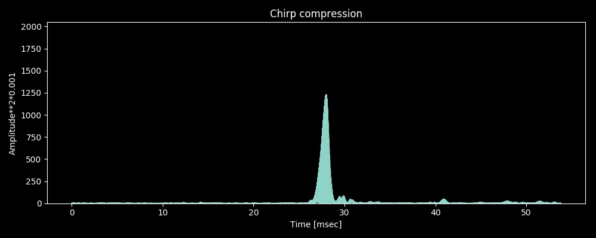

# Chirp compression



## Chirp compression technique

It is very simple:

```
c(n)=IFFT[FFT{a(n)} * FFT{b(n)}]

a(n): raw wave of received chirp signal with zero padding
    [ raw wave of N samples       | zero padding of N samples   ]

b(n): inverse reference chirp signal with zero padding
    [ matched filter of N samples | zero padding of N samples   ]

First half of c(n) is added to the second half of previous c(n):
    [ A                           | B                           ]
                                  [ A                           | B                           ]
                                                  |
                                                  V
                                                output

```

All the noise is not compressed, that is the point.

## System components

- [Receiver (STM32L476RG with Knowles MEMS microphones](./stm32)
- [Oscilloscope GUI (Tkinter and matplotlib)](./oscilloscope)

## Experiments (Dec 2, 2018)

```

Jupyter
Notebook                                                                          Chirp compression
 [PC]--[Mini speaker] ------ Chirp 15000Hz~18000Hz ------> [MEMS mic]--PDM-->[DFSDM][Arm Cortex-M4]
                                                                                          |
                                                                                         UART
                                                                                          V
                                                                                    [Oscilloscope GUI]

```

The screenshot above is captured by the oscilloscope GUI:
- Chirp transmitted by a very very cheap mini speaker at $1.
- Very small volume of the sound.
- 2 meters distance between the transmitter and the receiver.
- Background music (not background noise for me): Framenco guitar music by Paco de Lucia.

Parameters:
- Clock: 80_000_000/25(Divider)/42(FOSR) = 76.2kHz
- Frame length: 1024 samples, 13.4msec
- Sweep range: 15000Hz ~ 18000Hz

## Remaining issues (Nov 3, 2018)

- Its comression is not so good.
- It requires to increase the sampling frequency.
- FFT of 1024 samples is too small, but I could not increase the size due to the limitaion of RFFT in CMSIS-DSP somehow...

## Reference

- [Radar pulse compression](https://www.ittc.ku.edu/workshops/Summer2004Lectures/Radar_Pulse_Compression.pdf)
- [Chirp compression](https://en.wikipedia.org/wiki/Chirp_compression)
