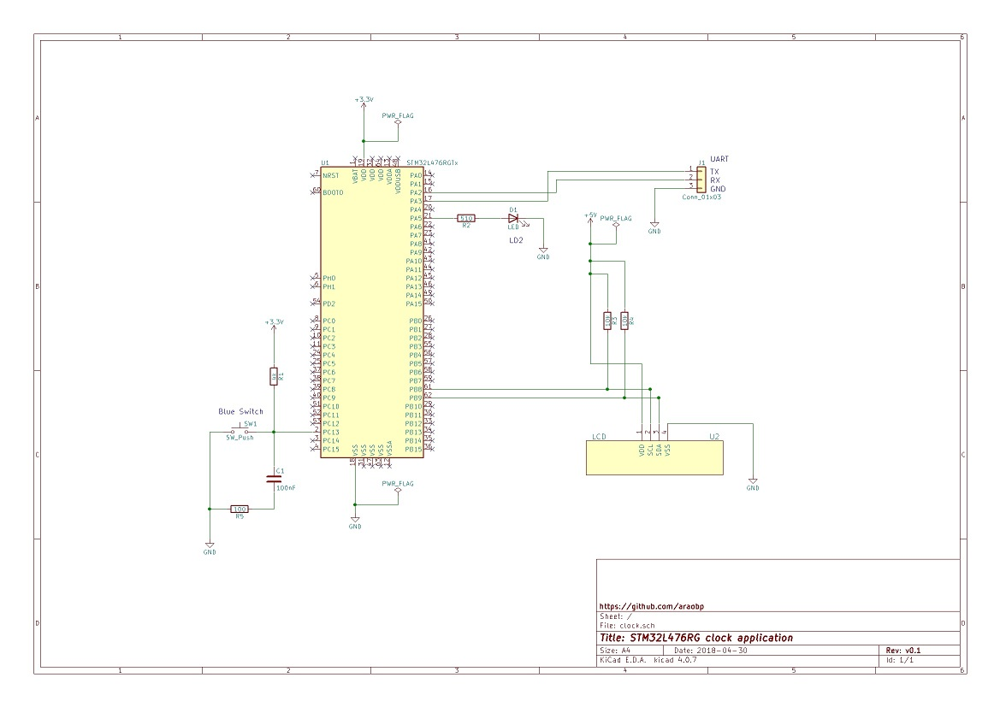

# Clock application


This is a sample clock application using STM32 RTC capability and an external I2C LCD.

## Parts

- [I2C character LCD](http://akizukidenshi.com/catalog/g/gK-08896/)

## Wiring


## Schematic

Note: PB8 and PB9 pins are 5V-tolerant as per [the datasheet](http://www.st.com/resource/en/datasheet/stm32l476je.pdf).



## Clock setting

Use terminal emulator such as Teraterm to open the COM port.

If the current date and time is "May 2, 2018" on Tuesday, then the command is like this:

```
18 5 2 16 25 2[LF]
```

Push the user button (blue button) on the Nucleo board to show the date and time on the terminal emulator.

## LCD output

This application output date and time to LCD every 30 seconds.
