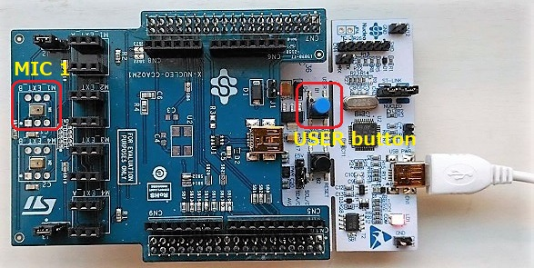
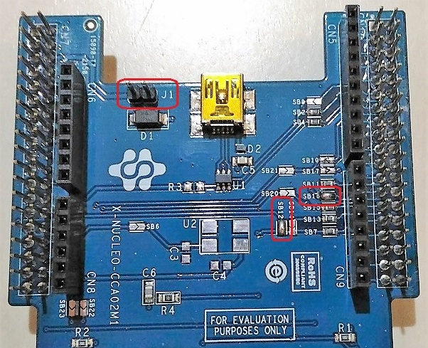

# MEMS Microphones

Use this code https://github.com/y2kblog/NUCLEO-L476RG_DFSDM_PDM-Mic to test X-NUCLEO-CCA02M1 expansion board.

## DFSDM microphone acquisition

```
                    . . . . . . . . . . . . . . Arm Cortex-M4 . . . . . . . . . . . .
                    .   +-------+                                FFT                .
     +----- Clock ------|       |          +-----+   +-----+   +------+   +------+  .
     |              .   | DFSDM |-- PCM -->| DMA |-->| RAM |-->| Core |-->|USART2|-- UART/USB --> PC
     |              .   |       |          +-----+   +-----+   | DSP  |   +------+  .
     v              .   |       |                              +------+             .
[MEMS mic]--- PDM ----->|       |                                                   .
                    .   +-------+                                                   .
                    . . . . . . . . . . . . . . . . . . . . . . . . . . . . . . . . .
```

## Expansion board

Use [X-NUCLEO-CCA02M1](http://www.st.com/en/ecosystems/x-nucleo-cca02m1.html) expansion board to test MEMS microphones with DFSDM.



As per the MEMC mic datasheet, input clock frequency Max value is 3.25MHz.

Given the system clock rate at 80MHz, the clock divider should be larger than 25.

To obtain 100kHz sampling rate, the clock divider is set to 25 and the decimation factor to 32.

## Bridge/jumper setting for one microphone (M1) acquisition



Solder bridges to be closed

|Bridge|Connector|Pin number|STM32L476RG pin|
|------|---------|----------|---------------|
|SB12  |CN7      |35        |PC2            |
|SB16  |CN10     |28        |PA6, PB14      |

Jumper pin setting

|Jumper|Position|Description           |
|------|--------|----------------------|
|J1    |Open    |5V generated on Nucleo|
|J2    |1-2     |Use on-board MIC 1(M1)|

## STM32L476RG pinout configuration (CubeMX)


## Schematics

- [NUCLEO-L476RG schematic](http://www.st.com/resource/en/schematic_pack/nucleo_64pins_sch.zip)
- [X-NUCLEO-CCA02M1 schematic](http://www.st.com/content/ccc/resource/technical/layouts_and_diagrams/schematic_pack/ae/8d/91/e9/14/bc/4f/0e/x-nucleo-cca02m1_schematic.pdf/files/x-nucleo-cca02m1_schematic.pdf/jcr:content/translations/en.x-nucleo-cca02m1_schematic.pdf)

## Code (forked one)

https://github.com/araobp/NUCLEO-L476RG_DFSDM_PDM-Mic

Note: The project above has been converted from SW4STM32 into TrueSTUDIO project, and I have modified the pinout on CubeMX for the expansion board. I have also changed the operation to take a single-shot FFT result by pushing USER button on Nucleo board.

### UART

|Parameter   |Value    |
|------------|---------|
|Baud rate   |115200bps|
|Data        |8bit     |
|Parity      |None     |
|Stop        |1bit     |
|Flow control|None     |

## Test under 15000Hz tone


