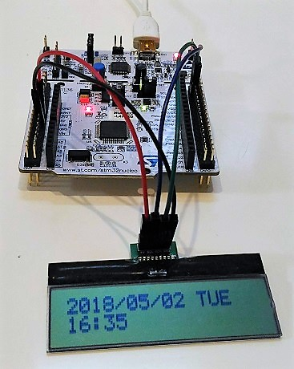

# STMicroelectronics STM32 MCU evaluation



Clock application with STM32L476RG

## Motivation

Compare STMicro STM32 with Microchip PIC16F1 MCUs.

## IDE

I use TrueSTUDIO with Cube MX.

- [TrueSTUDIO](https://atollic.com/truestudio/)
- [STM32 CubeMX Eclipse plugin](http://www.st.com/en/development-tools/stsw-stm32095.html)

TrueSTUDIO is a great IDE. CubeMX is also nice.

## Evaluation

I have got these STM32 boards.

### [STM32L476 Nucleo-64](http://www.st.com/en/evaluation-tools/nucleo-l476rg.html)

- [Schematics](http://www.st.com/resource/en/schematic_pack/nucleo_64pins_sch.zip)
- [Datasheet](http://www.st.com/resource/en/datasheet/stm32l476je.pdf)

#### Sample applications

- [Clock](./STM32L476-Nucleo-64/Clock/README.md)
- [MEMSMIC](./STM32L476-Nucleo-64/MEMSMIC/README.md)

### [STM32F4 Discovery](http://www.st.com/en/evaluation-tools/stm32f4discovery.html)

- [Schematics](http://www.st.com/resource/en/schematic_pack/stm32f4discovery_sch.zip)
- [Datasheet](http://www.st.com/resource/en/datasheet/dm00037051.pdf)

#### Sample applications

- [BlueSwitch](./stm32-mcu/STM32F4-Discovery/BlueSwitch/)
- [HelloWorld](./stm32-mcu/STM32F4-Discovery/HelloWorld/)
- [LED_blinking](./stm32-mcu/STM32F4-Discovery/LED_blinking/)
- [PWM-output](./stm32-mcu/STM32F4-Discovery/PWM-output/)

#### UART and printf

I managed to support printf on USART2.


Physical configuration:

```
STM32F407
               +------------+
            X 5V            |
GND     ----- GND  FTDI     |
PA3(RX) ----- TX  USB-UART  ===== USB ======> PC
PA2(TX) ----- RX  converter |
               +------------+
```

Include the following snippet in main.c to support printf:

```
int _write(int file, char *pbuf, int len)
{
  HAL_UART_Transmit(&huart2, (uint8_t *)pbuf, len, 1000);
  return len;
}
```

#### PWM

PWM output (100Hz, 50% duty) to PA8:


## STM32Cube packages

- [STM32CubeL4](https://my.st.com/content/my_st_com/en/products/embedded-software/mcus-embedded-software/stm32-embedded-software/stm32cube-mcu-packages/stm32cubel4.license%3d1524847579867.html)

## References

- http://stm32f4-discovery.net/

## Other interests

- [STM32L0 Discovery Kit LPWA](http://www.st.com/en/evaluation-tools/b-l072z-lrwan1.html)
- [AWS FreeRTOS](https://aws.amazon.com/freertos/getting-started/)
- [ESP-IDF](https://esp-idf.readthedocs.io/en/v2.0/index.html)
