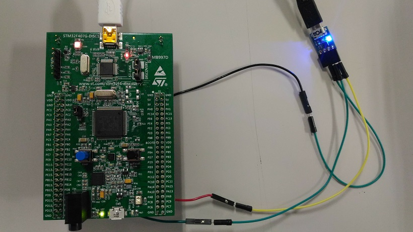

# STMicroelectronics STM32 MCU evaluation


This is me.

## IDE

- [TrueSTUDIO](https://atollic.com/truestudio/)
- [STM32 CubeMX](https://www.st.com/en/development-tools/stm32cubemx.html)

## Evaluation

STMicro has given me NUCLEO-L476RG and NUCLEO-F401RE with expansion boards for free at trade shows in year 2018. Thanks a lot to STMicro!

### [NUCLEO-F401RE](http://www.st.com/en/evaluation-tools/nucleo-f401re.html) board

#### Applications

- [X-CUBE-AI](./NUCLEO-F401RE/AI)
- [Thermography (infrared array sensor) and rock-paper-scissors recogniton with Keras/TensorFlow](./NUCLEO-F401RE/Thermography)
- [Eddystone beacon](./NUCLEO-F401RE/Beacon) ... the source code is generated by CubeMX
- [SensorDemo](./NUCLEO-F401RE/SensorDemo) ... the source code is generated by CubeMX

### [NUCLEO-L476RG](http://www.st.com/en/evaluation-tools/nucleo-l476rg.html) board

#### Applications

- [HelloWorld](./NUCLEO-L476RG/HelloWorld)
- [GPIO_Interrupt](.//GPIO_Interrupt)
- [Clock](./NUCLEO-L476RG/Clock/README.md)
- [CAN](./NUCLEO-L476RG/CAN/README.md)
- [MEMSMIC(MEMS mic expansion board)](./NUCLEO-L476RG/MEMSMIC/README.md)
- [ADC with DMA](./NUCLEO-L476RG/ADC/README.md)
- [DAC with triangular wave and sine wave](./NUCLEO-L476RG/DAC/README.md)
- [Mic->ADC->DAC pipeline](./NUCLEO-L476RG/Mic_ADC_DAC/README.md)
- [Sound Effector](./NUCLEO-L476RG/Sound_Effector)
- [Chirp compression](./NUCLEO-L476RG/Chirp_Compression)

### [STM32F4 Discovery](http://www.st.com/en/evaluation-tools/stm32f4discovery.html) board

#### Applications

- [BlueSwitch](./STM32F4-Discovery/BlueSwitch)
- [HelloWorld](./STM32F4-Discovery/HelloWorld)
- [LED_blinking](./STM32F4-Discovery/LED_blinking)
- [PWM-output](./STM32F4-Discovery/PWM-output)
- [AudioWeaver](./STM32F4-Discovery/AudioWeaver)

#### printf issue

I managed to support printf on USART2.



Physical configuration:

```
STM32F407
               +------------+
            X 5V            |
GND     ----- GND  FTDI     |
PA3(RX) ----- TX  USB-UART  ===== USB ======> PC
PA2(TX) ----- RX  converter |
               +------------+
```

Include the following snippet in main.c to support printf:

```
int _write(int file, char *pbuf, int len)
{
  HAL_UART_Transmit(&huart2, (uint8_t *)pbuf, len, 1000);
  return len;
}
```

#### PWM test

PWM output (100Hz, 50% duty) to PA8:


## Tips

- [CMSIS DSP RFFT pitfalls](./tips/CMSIS_DSP_RFFT.md)
- [Enabling DSP on STM32](./tips/ENABLE_DSP_AND_PRINTF.md)
- [PCM data resolution on STM32L4 DFSDM](./tips/RESOLUTION.md)

## References

### STM32L476 Nucleo-64

- [Schematics](http://www.st.com/resource/en/schematic_pack/nucleo_64pins_sch.zip)
- [Datasheet](http://www.st.com/resource/en/datasheet/stm32l476je.pdf)
- [STM32CubeL4](https://my.st.com/content/my_st_com/en/products/embedded-software/mcus-embedded-software/stm32-embedded-software/stm32cube-mcu-packages/stm32cubel4.license%3d1524847579867.html)

### STM32F4 Discovery board

- [Schematics](http://www.st.com/resource/en/schematic_pack/stm32f4discovery_sch.zip)
- [Datasheet](http://www.st.com/resource/en/datasheet/dm00037051.pdf)
