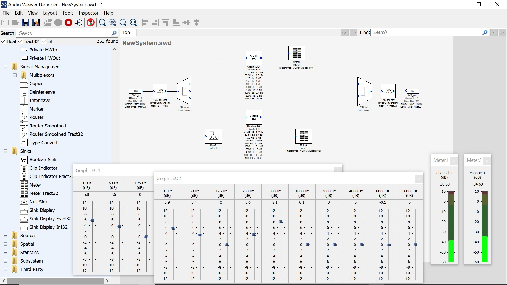

# STM32F4 with AudioWeaver

[I have alreayd developed sound effector on NUCLEO-L476RG](../../NUCLEO-L476RG/Sound_Effector), but it is nice to evaluate a tool for professional uses. AudioWeaver ST Edition is a free software and it supports STM32F4 Discovery.

## AudioWeaver ST Edition
- [Download](https://dspconcepts.com/downloads)

## Screen shot

