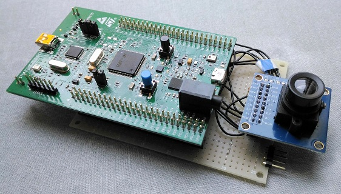
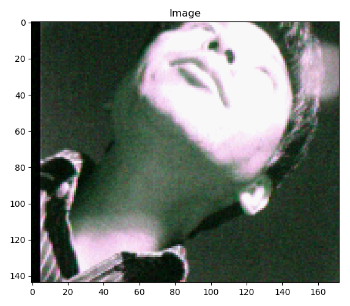

# Camera

(Work in progress)

## Goal

- Capture QCIF images.
- Cut out 128 x 128 pixel or 64 x 64 pixel images from QCIF for deep learning

## Parts

- [HiLetgo OV7670 camera module](https://www.amazon.co.jp/HiLetgo%C2%AE-ov7670%E3%82%AB%E3%83%A1%E3%83%A9%E3%83%A2%E3%82%B8%E3%83%A5%E3%83%BC%E3%83%AB-%E3%82%B7%E3%83%B3%E3%82%B0%E3%83%AB%E3%83%81%E3%83%83%E3%83%97-%E9%9B%86%E9%8C%B2%E3%83%A2%E3%82%B8%E3%83%A5%E3%83%BC%E3%83%AB%E3%82%AB%E3%83%A1%E3%83%A9/dp/B071JHKQCZ/ref=sr_1_fkmr1_2?s=diy&ie=UTF8&qid=1549848789&sr=8-2-fkmr1&keywords=%E3%82%AB%E3%83%A1%E3%83%A9%E3%80%80%E3%82%AA%E3%83%A0%E3%83%8B%E3%83%93%E3%82%B8%E3%83%A7%E3%83%B3+HiLetgo)

## Test circuit

### Schematic

- [OV7670 expansion board for STM32F4 Discovery](./kicad/ov7670_expansion_board.pdf)

### Initialization test

As per the OV7670 datasheet, SCCB slave addresses are:
- 0x42 for write
- 0x43 for read

My HiLetgo OV7670 module returned the following ID over SCCB:
- Product ID: 0x76
- Version: 0x73

### QCIF capture test

I faced a problem that **void HAL_DCMI_FrameEventCallback(DCMI_HandleTypeDef \*hdcmi)** is called every two **HAL_StatusTypeDef HAL_DCMI_Start_DMA(DCMI_HandleTypeDef\* hdcmi, uint32_t DCMI_Mode, uint32_t pData, uint32_t Length)** calls.

It took a whole day to determine the cause of the problem. OV7670 seems like outputing 172x144 pixels rather than 176x144.

### Showing an image on PC

I started developing an utilty program in Python to capture an image with the device and to show it on my PC.

I took a picture of myself. It seems like requiring calibraion on its color map.

## References

- [IT Text 画像工学](https://www.ohmsha.co.jp/book/9784274220074/)
- [Serial Camera Control Bus
Functional Specification ](http://www4.cs.umanitoba.ca/~jacky/Teaching/Courses/74.795-LocalVision/ReadingList/ov-sccb.pdf)
- [OV7670 datasheet](https://www.voti.nl/docs/OV7670.pdf)
- [OV7670 implementation guide](http://www.haoyuelectronics.com/Attachment/OV7670%20+%20AL422B%28FIFO%29%20Camera%20Module%28V2.0%29/OV7670%20Implementation%20Guide%20%28V1.0%29.pdf)
- [Digital camera interface (DCMI) for STM32 MCUs](https://www.st.com/content/ccc/resource/technical/document/application_note/group0/c0/ef/15/38/d1/d6/49/88/DM00373474/files/DM00373474.pdf/jcr:content/translations/en.DM00373474.pdf)
- [STM32マイコンによるデジタルカメラの作成](https://qiita.com/take-iwiw/items/212ddb6faa05412c83b7)
- [STM32マイコンでOV7670などとSCCB通信する際の注意点](https://qiita.com/take-iwiw/items/cf10034890d2784676d0)
- https://github.com/maslovk/STM32_OV7670/blob/master/Src/OV7670.c
- https://os.mbed.com/users/diasea/notebook/ov7670_FIFO_AL422B/
- https://thinksmallthings.wordpress.com/2012/11/03/ov7670-yuv-demystified/comment-page-1/
- https://ja.scribd.com/document/356160003/Beginning-Arduino-Ov7670-Camera-Development

