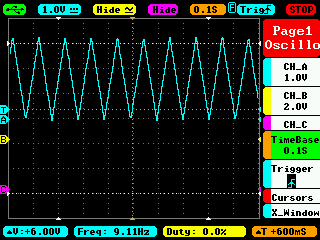

# DAC test

## 12bit DAC dynamic range

- 12bit DAC supported by STM32L4: 20 * log10(2^12) = 72dB
- Analog disk/tape: 60dB that corresponds to 10bit resolution ( ~ 20 * log10(2^10))
- CD: 20 * log10(2^16) = 96dB

## Triangular wave

- [Triangular wave test on Arm Cortex-M4(STM32L476RG)](./triangular_wave)

## Sine wave

- [Sine wave test on Arm Cortex-M4(STM32L476RG)](./sine_wave)

#### Clipping problem

I observed audio clipping with my oscilloscope when sine wave was being generated on the DAC. The range of sine wave was "int16_t 0 to 128", and part of the waveform under around "int16_t 40" did not appear on my oscilloscope.

Possible reason:
- https://community.st.com/s/question/0D50X00009XkWaESAV/stm32l476-dac-usable-range-and-adc-offset

