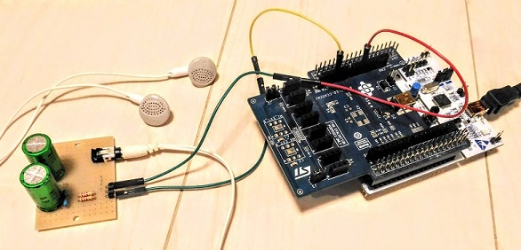
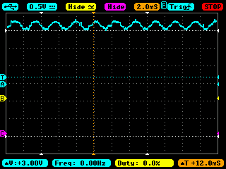
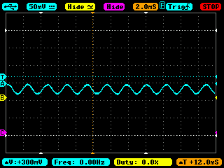

## Analog filter

Some of the applications in this project require an analog filter for DAC to remove quantization noise and to remove DC (AC coupling).



- [Circuit simulation (LTspice)](./ltspice)
- [Frequency response (LTspice)](./ltspice/LPF_HPF_for_DAC_and_earphone.pdf)
- [Circuit schematic (KiCad)](./kicad/dac2earphone.pdf)

Input signal before the analog filter:



Output signal after the analog filter:



## Wirling the analog filter to Arduino connector

- Connect PA4 to left-channel pin header,
- Connect PA5 to right-channel pin header,
- Connect GND to GND pin header,
on the analog filter board.

```
                                     [ ]
                                     [ ]
                                     [ ]
                                     [ ]
  [ ]                                [*] PA5(DAC1 OUT2)
  [ ]                                [ ]
  [ ]                                [ ]
  [ ]                                [ ]
  [ ]                                [ ]
  [*] GND                            [ ]
  [ ]
  [ ]                                [ ]
                                     [ ]
  [ ]                                [ ]
  [ ]                                [ ]
  [*] PA4(DAC1 OUT1)                 [ ]
  [ ]                                [ ]
  [ ]                                [ ]
  [ ]                                [ ]
  ```

